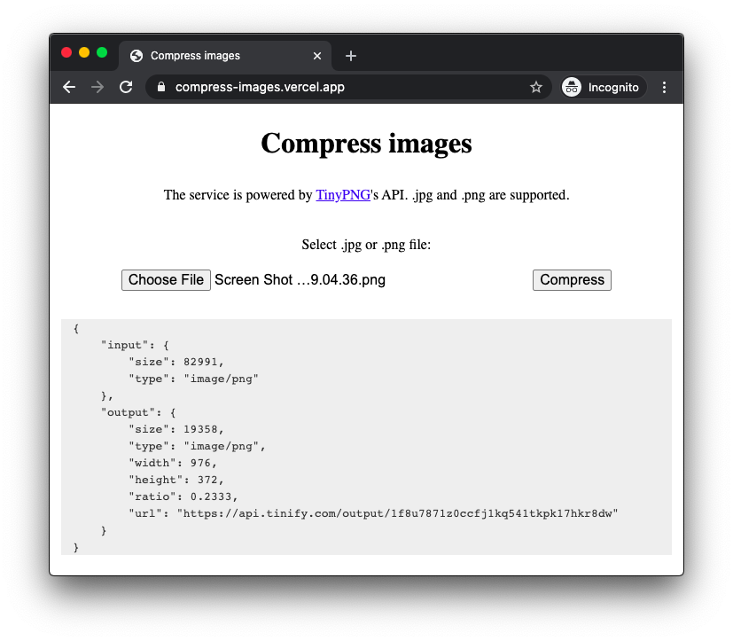

# Compress images through tinypng.com

https://compress-images.vercel.app/



## API

Send your image to https://compress-images.vercel.app/api/compress, e.g.,

```
$ curl -i --data-binary @image.png https://compress-images.vercel.app/api/compress
HTTP/2 201
content-type: application/json
location: https://api.tinify.com/output/rq03mkpzguz1h6d91mnnmunxjwghb2y9
content-length: 301
date: Sat, 08 Aug 2020 17:49:11 GMT
x-vercel-cache: MISS
server: Vercel
x-vercel-id: hkg1::sfo1::l9hcm-1596908948423-46b72936acdc
strict-transport-security: max-age=63072000; includeSubDomains; preload
cache-control: s-maxage=0

{
    "input": {
        "size": 147349,
        "type": "image/png"
    },
    "output": {
        "size": 32502,
        "type": "image/png",
        "width": 827,
        "height": 723,
        "ratio": 0.2206,
        "url": "https://api.tinify.com/output/rq03mkpzguz1h6d91mnnmunxjwghb2y9"
    }
}
```
